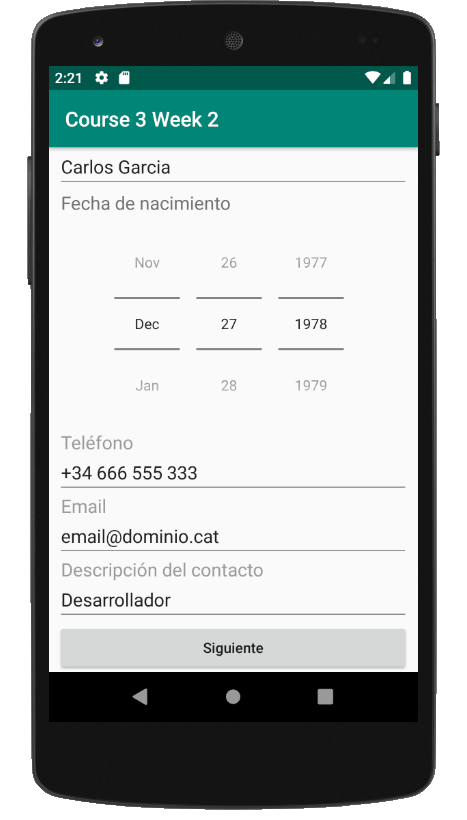
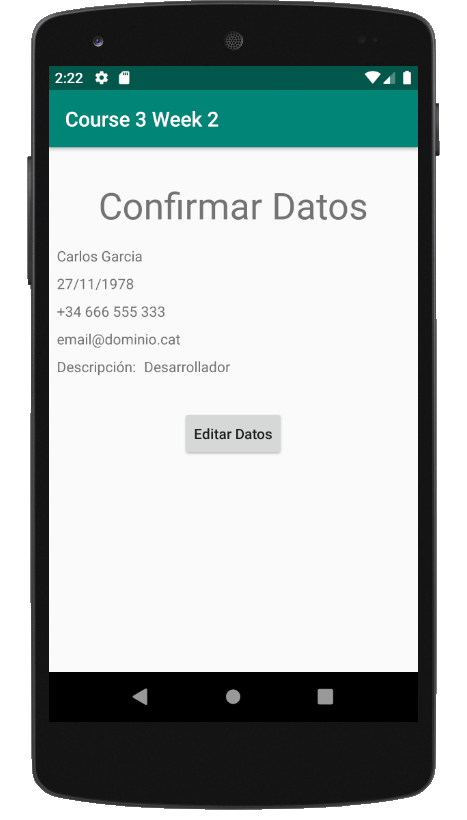

# Descripción
Assignment semana 2 curso Desarrollo de aplicaciones con Android (Coursera).

https://www.coursera.org/learn/desarrollo-de-aplicaciones

Desarrollo de app con las siguientes características:
  - Activity 1 (principal):
    - Formulario de contacto donde se solicitan los siguientes campos: nombre completo, fecha de nacimiento (DatePicker), teléfono, email, descripción del contacto
    - Botón "Siguiente" que lleva a Activity 2
   - Activity 2:
     - Pantalla de confirmación de datos donde se muestren datos introducidos en Activity 1, y botón "Editar Datos" que lleve de nuevo a Activity 1 con los datos previamente introducidos
     
# Objetivos
  - Utilización de elemento EditText de Material Design
  - Utilización DatePicker
  - Transición y envío de información entre Activities

# Desarrollo

Desarrollado con 2 opciones:

 -Opción 1:
    Iniciamos la Activity ConfirmarDatos dejando que esta MainActivity quede en el stack (onPause).
    Con esta opción, para volver y encontrar los datos el botón de Editar Datos actuará el botón de volver atrás
  
 -Opción 2:
    Cuando iniciamos la Activity ConfirmarDatos destruímos MainActivity.
    Con esta opción liberamos memoria, a cambio de tener que enviar los datos de vuelta al presionar el botón Editar Datos
 
 Proyecto subido con opción 2, para utilizar opción 1:
 
    -Comentar las siguientes líneas:
        MainActivity: 65-71
        ConfirmarDatos: 57-63
        
    -Descomentar las siguientes líneas:
        MainActivity: 55-61
        ConfirmarDatos: 47-54

# Capturas de pantalla
## Activity 1 (MainActivity)

## Activity 2 (ConfirmarDatos)

